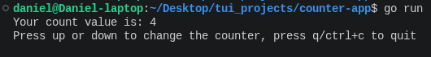

# Counter Terminal User Interface (TUI) Application

This is a simple counter application built using the **Bubble Tea v2** framework in Go. It demonstrates the basic "Elm Architecture" (Model-Update-View) used for building interactive terminal applications.



## Features

* **Real-time state updates:** The counter updates instantly on keypress.
* **Multiple Input Support:** Supports both arrow keys and Vim-style navigation (`k`/`j`).
* **Clean Exit:** Quick exit using `q` or `Ctrl+C`.

## Prerequisites

To run this application, you need **Go 1.26** or later installed. You can download it from the official [Go website](https://go.dev/).

## Installation

# Clone the repository
git clone <your-repo-url>
cd <repo-name>

# Go will automatically download dependencies when you run:
go run .

## Usage

Navigate to the directory containing `main.go` and execute:

```bash
go run .

```

### Keybindings

| Key | Action |
| --- | --- |
| `up` / `k` | Increment counter |
| `down` / `j` | Decrement counter |
| `q` / `Ctrl+C` | Quit application |